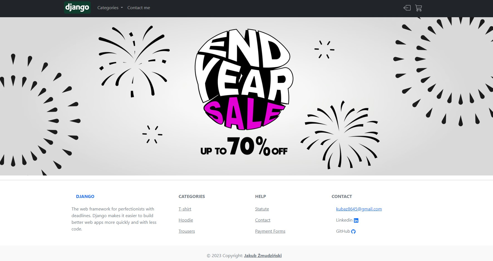
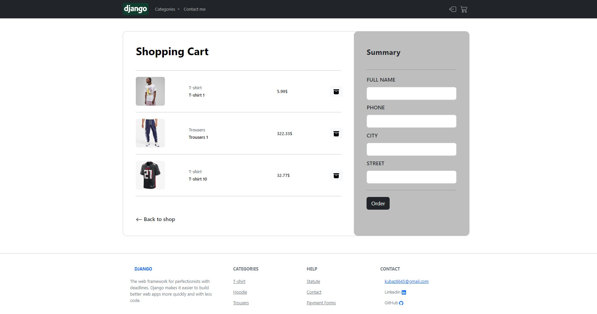
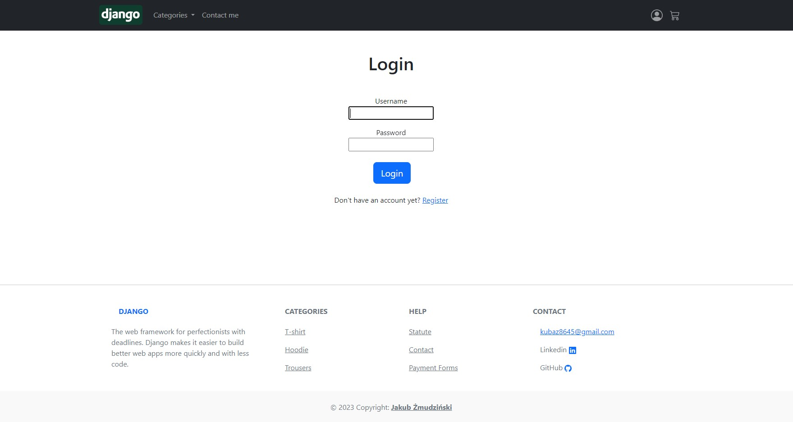
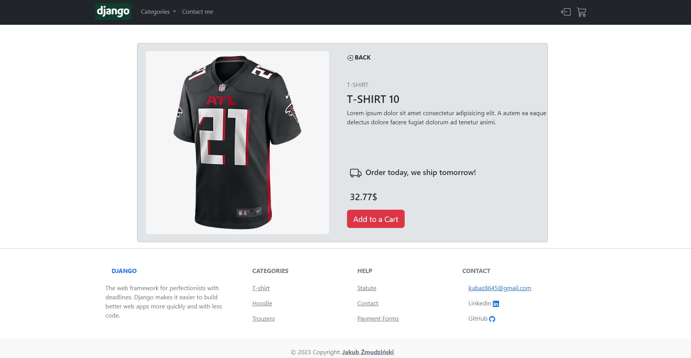

## Installation

Windows Installation:

```bash
python -m venv venv
venv\Scripts\activate
```

Use the package manager [pip] to install project's requirements.

```bash
pip install -r requirements.txt
```
You have to configure Postgresql on your desktop and do some migrations

Now you can run the project with this command

```bash
python manage.py runserver
```

## All details of products (collections, description, price etc.), all details of basket, basketitems are stored in Database. They're not hardcoded to a HTML code

Some images from the App








